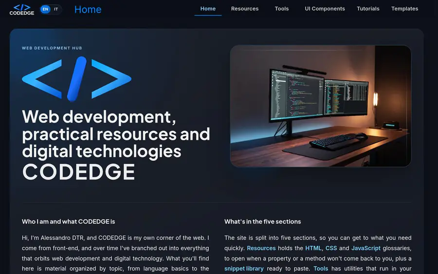
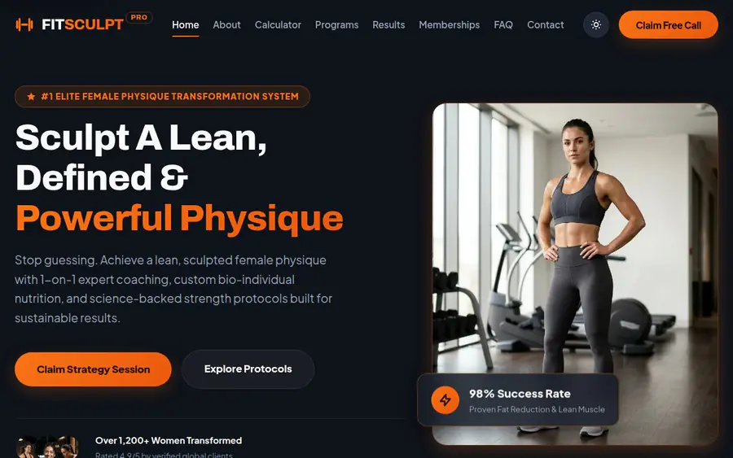
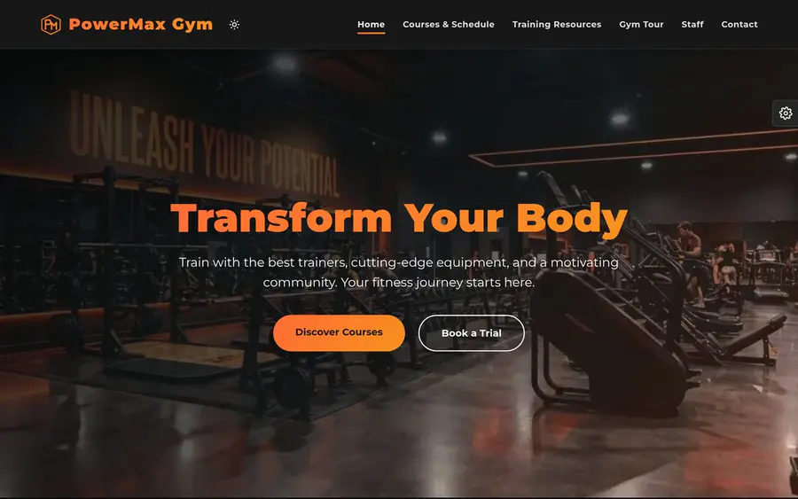
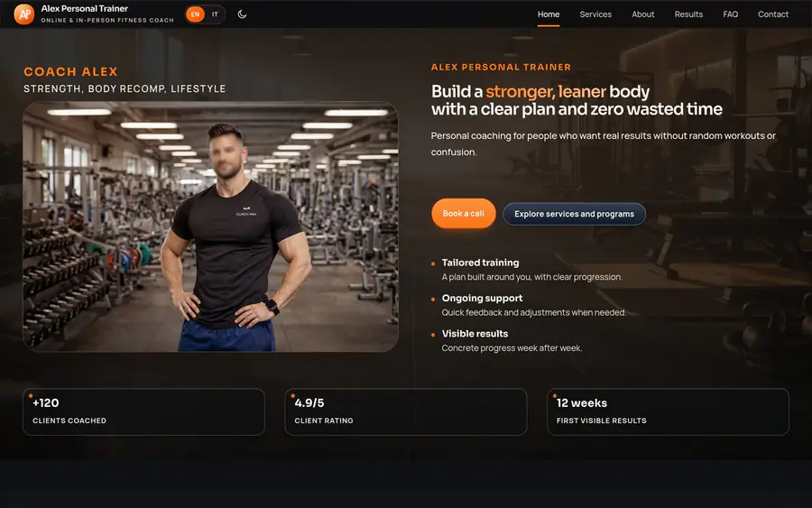
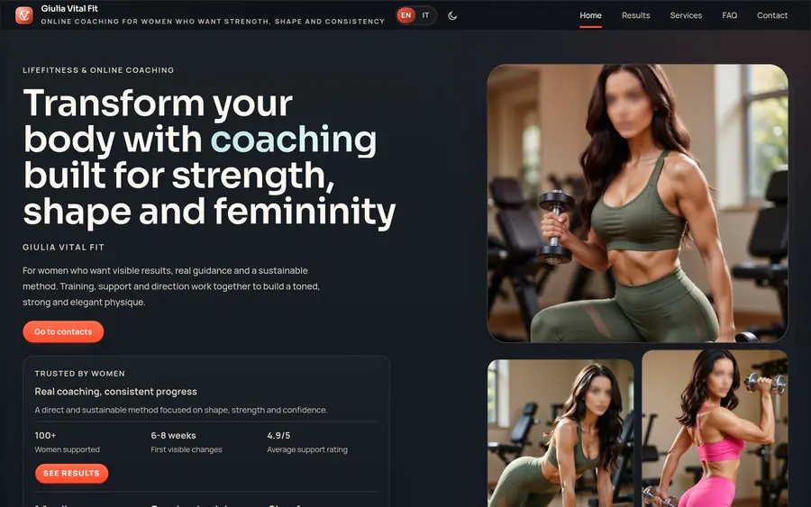
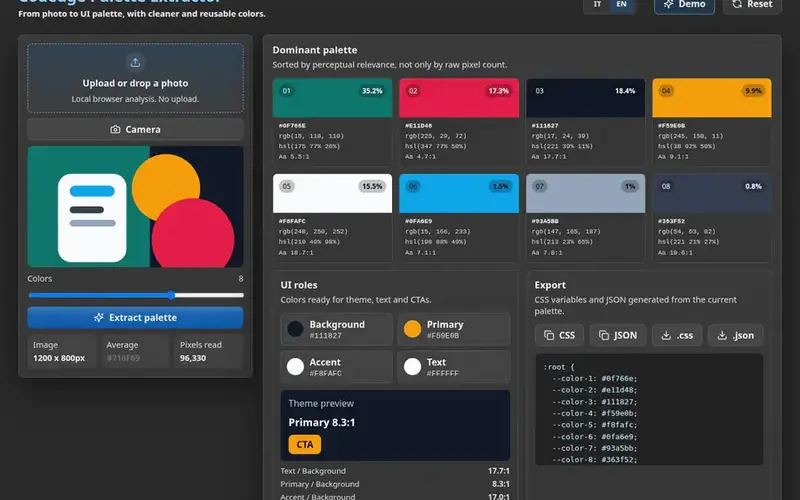

## Alessandro DTR

Front-end in plain HTML, CSS and JavaScript — no framework, no CMS and no bought theme
under any of it. Sites, PWAs and website templates, mostly for fitness, sports and
wellness.

I start from something that runs. I'd rather have a component that actually works than
a flawless explanation of how it would work — the code here was written to be used, not
to be illustrated.

The other half is less fun and matters more: verifying. A change that "should work"
isn't finished. It gets opened in the browser, looked at on a large screen and a small
one, and checked against what already worked before.

Everything below is live. Open the projects on your phone or your desktop and see how
they hold up.

---

### codedge.it

[**codedge.it**](https://codedge.it) is my site and my main project: 418 glossary
entries across HTML, CSS and JavaScript, 12 tutorials, 4 tools and 4 documented UI
components. Bilingual, assembled with Vite, built on GitHub Actions and deployed to
Cloudflare Pages.

The tools run entirely in the browser — compress an image and the file never leaves
your computer, because there's no request to send it anywhere. Components ship with
ARIA attributes and keyboard focus handling written in, not bolted on afterwards.

Source: [aledtr77/codedge](https://github.com/aledtr77/codedge)

---

### Templates

Portfolio projects, each with a live demo. One has its source public, published as a
code reference — this is what my markup and CSS actually look like. Start there if you
came here to read code rather than look at screenshots.

#### FitSculpt Pro — source public

Landing page for physique and body-sculpting coaches, built around getting the visitor
to book a call. Everything that converts sits on the one page, reached by anchor from a
single navigation bar: metrics calculator, filterable program grid, membership tiers,
booking dialog. Light and dark themes.

Free to use, modify and deploy — personal projects and client work included. You may
not redistribute or sell it as a template, theme or starter kit, modified or not.

[Live demo →](https://fitsculpt-pro.pages.dev/) · Source:
[aledtr77/template-fitsculpt-pro](https://github.com/aledtr77/template-fitsculpt-pro)

#### The other four — paid

Full sources on [Etsy](https://www.etsy.com/shop/CodedgeStudio), demos browsable here.

**PowerMax Gym** — multi-page site for gyms and sports centres. Dark interface, sharp
calls to action. [Live demo →](https://powermax-gym.pages.dev/)

**Mind & Motion** — multi-page site for wellness, yoga and pilates. Light and dark
themes. [Live demo →](https://mind-and-motion.pages.dev/)

**Alex Personal Trainer** — multi-page site built around collecting enquiries.
[Live demo →](https://04-fitness-coach.pages.dev/)

**Giulia Vital Fit** — bilingual editorial landing page aimed at a single action.
[Live demo →](https://coach-lifefitness.pages.dev/)

---

### Tools

**Palette Extractor** — pulls a colour palette out of an image and turns it into UI
roles, WCAG contrast ratios, CSS custom properties and JSON. Runs entirely in the
browser, so the file never leaves your computer.

Its own repo, one concern per file, 42 tests over the colour maths. Start with
`color.js` and `extractor.js` — that is where the actual thinking is.

[Live demo →](https://color-extraction.pages.dev/) · Source:
[aledtr77/palette-extractor](https://github.com/aledtr77/palette-extractor)

codedge.it ships it too, as one of its four tools built into the site.

---

### Work with me

Available for commissioned work: sites and landing pages, custom components, changes
to projects that already exist.

**contatti.codedge@gmail.com** · [codedge.it/contact](https://codedge.it/contact/)
