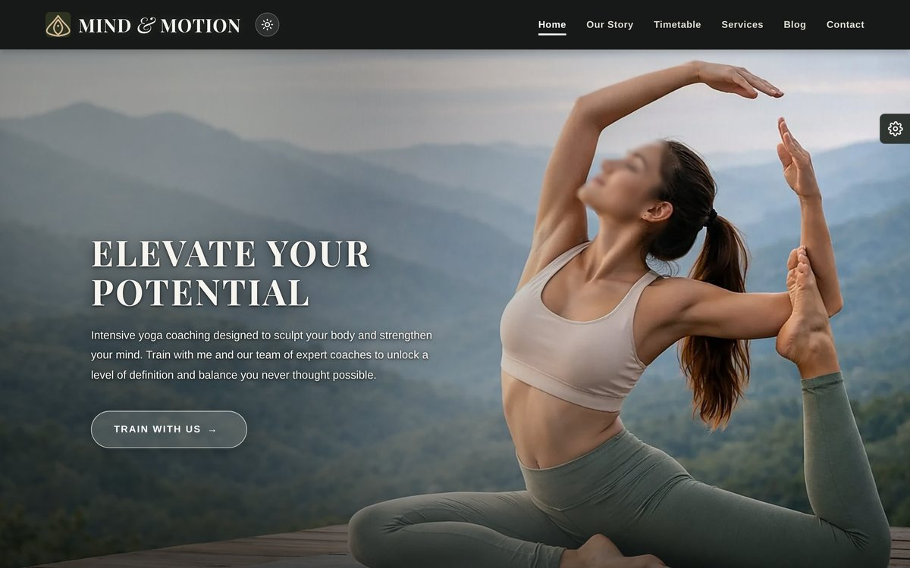
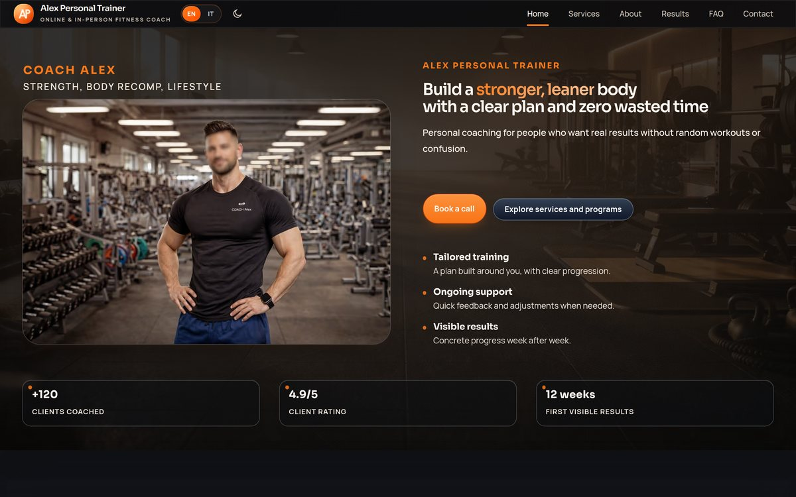

## Alessandro DTR

Front-end developer. I've been building for the web since 2023: sites and landing
pages in HTML, CSS and JavaScript written by hand — no framework, no CMS, no bought
theme underneath.

Everything linked below is online and browsable. Open it on a phone if you want to
check the responsive part.

---

### codedge.it

[**codedge.it**](https://codedge.it) is my site and my main project: 418 glossary
entries across HTML, CSS and JavaScript, 12 tutorials, 4 tools and 4 documented UI
components. Bilingual, assembled with Vite, built on GitHub Actions and deployed to
Cloudflare Pages.

The tools run entirely in the browser — compress an image and the file never leaves
your computer, because there's no request to send it anywhere. Components ship with
ARIA attributes and keyboard focus handling written in, not bolted on afterwards.

Source: [aledtr77/codedge](https://github.com/aledtr77/codedge)

---

### Templates

Portfolio projects, each with a live demo. Full sources are on
[Etsy](https://www.etsy.com/shop/CodedgeStudio).

<table>
<tr>
<td width="50%">
  
  <b>PowerMax Gym</b> 
  Multi-page site for gyms and sports centres. Dark interface, sharp calls to action. 
  <a href="https://powermax-gym.pages.dev/">Live demo →</a>
</td>
<td width="50%">
  
  <b>Mind &amp; Motion</b> 
  Multi-page site for wellness, yoga and pilates. Light and dark themes. 
  <a href="https://mind-and-motion.pages.dev/">Live demo →</a>
</td>
</tr>
<tr>
<td width="50%">
  
  <b>Alex Personal Trainer</b> 
  Multi-page site built around collecting enquiries. 
  <a href="https://04-fitness-coach.pages.dev/">Live demo →</a>
</td>
<td width="50%">
  
  <b>Giulia Vital Fit</b> 
  Bilingual editorial landing page aimed at a single action. 
  <a href="https://coach-lifefitness.pages.dev/">Live demo →</a>
</td>
</tr>
</table>

**[FitSculpt Pro](https://github.com/aledtr77/template-fitsculpt-pro)** — a fitness and
coaching landing page template, free to use: the source is public, clone it and go.
Still being tidied up.

---

### Tools

**[Palette Extractor](https://codedge.it/tools/palette-extractor/)** — pulls a colour
palette out of an image. Runs entirely in the browser, so the file never leaves your
computer. Source: [aledtr77/palette-extractor](https://github.com/aledtr77/palette-extractor)

---

### How I work

I start from something that runs. I'd rather have a component that actually works than
a flawless explanation of how it would work — the code I publish was written to be
used, not to be illustrated.

The other half is less fun and matters more: verifying. A change that "should work"
isn't finished. It gets opened in the browser, looked at on a large screen and a small
one, and checked against what already worked before.

---

### Work with me

Available for commissioned work: sites and landing pages, custom components, changes
to projects that already exist.

**contatti.codedge@gmail.com** · [codedge.it/contact](https://codedge.it/contact/)
